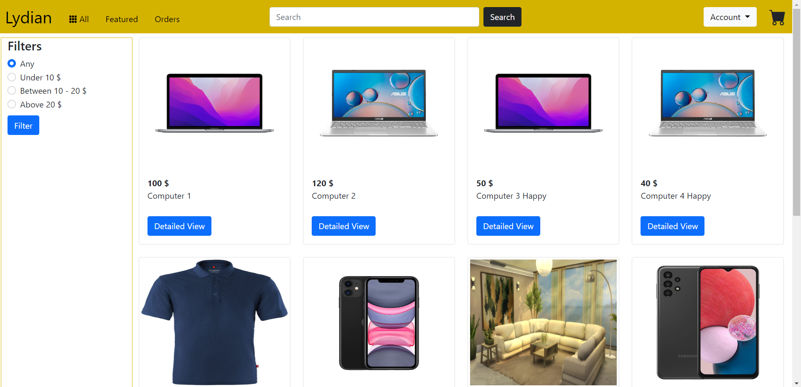
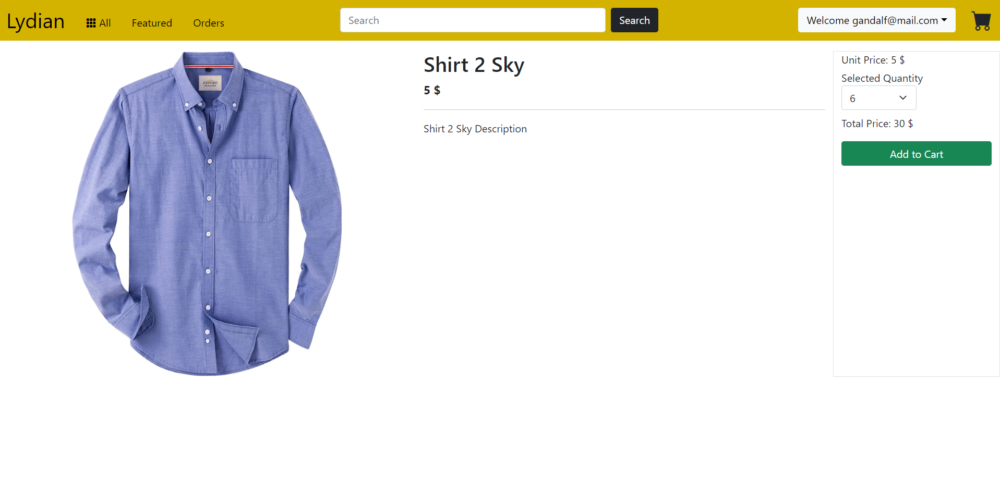
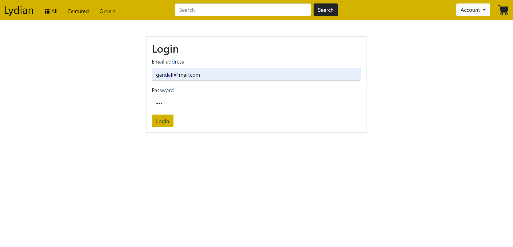
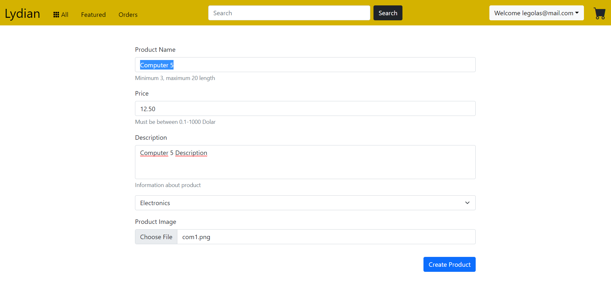
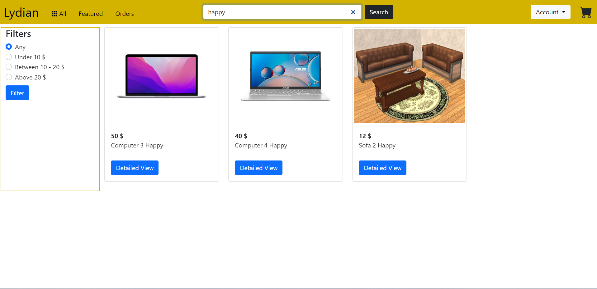
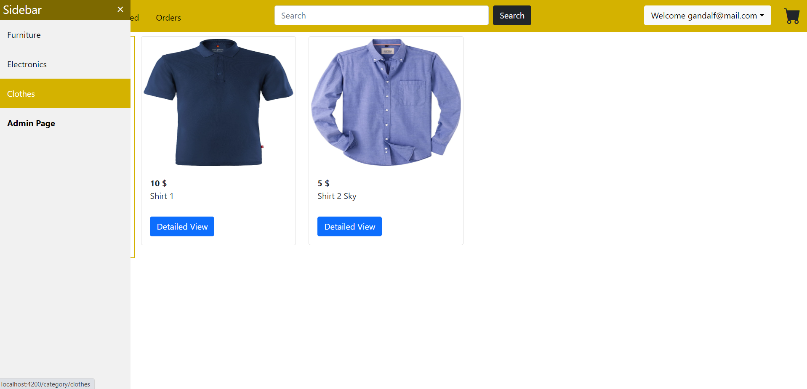
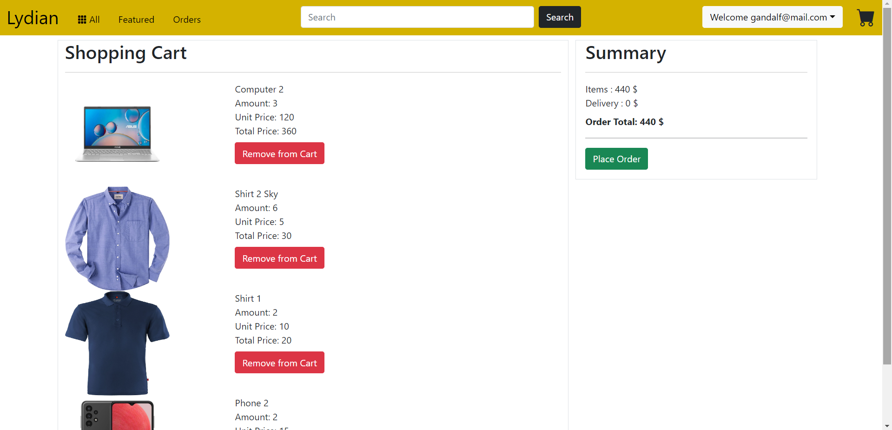
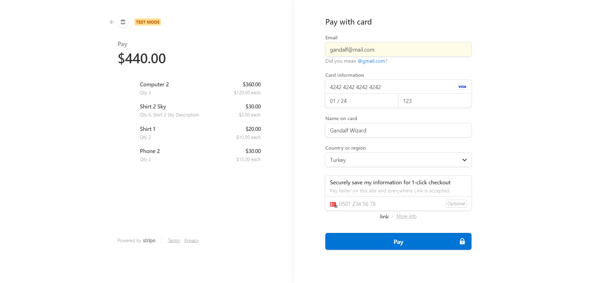
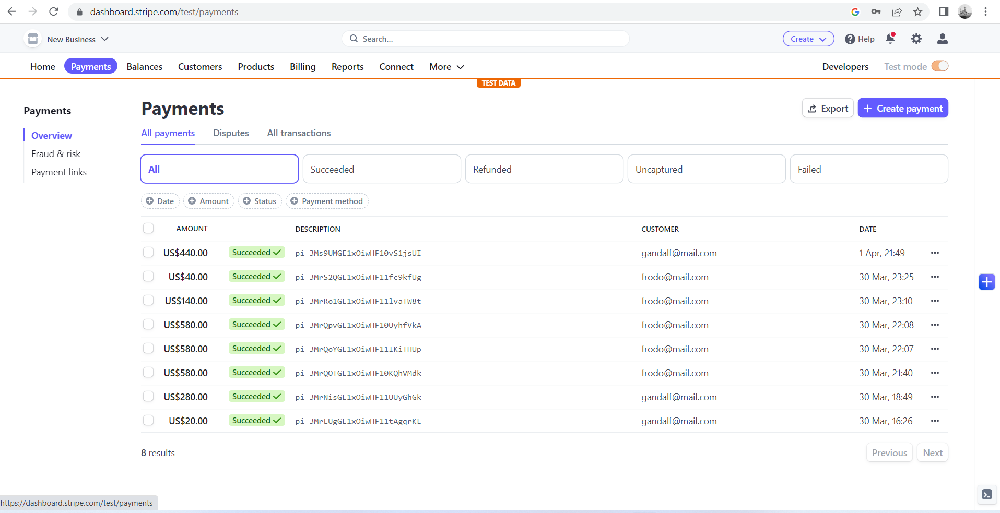

# Lydian - E-Commerce Application

Lydian is e-commerce application that have rest api back-end with .Net 5.0,
Angular spa front-end, Sql Server database. Using Dapper micro orm for interact with database.
Lydian have classic e-commerce application feature. 
Looking for products, filter products
by search keywords and categories, product details, cart system for shopping. 
Authentication for users. Create orders and get payments for order.
Using Stripe for payment system. This application made with database first approach so there is no migration in it. You can find database import file in Data folder.

### Main

### Product

### Login

### Create New Product

### Search Keyword

### Category

### Cart

### Payment

